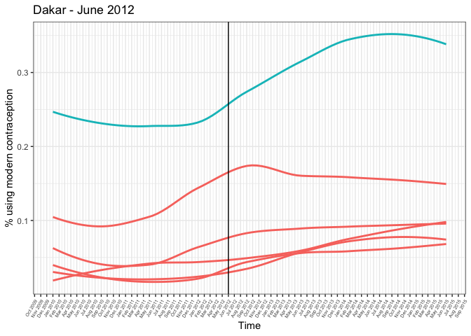

BST 260 Final Project - District-Level Trends in Postpartum
Contraceptive Use in Senegal Following a Contraceptive Supply Chain
Intervention
================
Dea Oviedo
2022-12-13

# Introduction

In 2012, the Senegalese government implemented the Informed Push Model
(IPM), a supply chain model where third-party logisticians were
contracted to deliver family planning supplies to service delivery
points directly from regional storerooms. After the intervention pilot
in Dakar in 2012 nearly eliminated stock-outs for contraceptives, the
Senegalese government decided to expand the IPM across different
districts over a 3-year period before scaling up the intervention at a
national level.\[1\] There is limited evidence on the impact of the IPM
on contraceptive use.\[2\] To help fill this gap, this work will look at
trends in modern contraceptive use among postpartum women (an important
beneficiary group of family planning policies and programs given the
benefits of increased birth intervals on the health of mothers and their
babies) before and after the IPM was implemented. Districts where the
IPM was implemented prior to January 2015 will serve as the intervention
districts. These districts are Dakar (Dec 2012); Kaolack and Thies (Apr
2013); Diourbel, Fatick, Kaffrine and Matam (Mar 2014); Saint-Louis (Apr
2014); and Louga (Jul 2014). Districts where the IPM was implemented
after January 2015 will serve as comparison districts (Tambacounda,
Kolda, Kedougou, Sedhiou and Ziguinchor).

The Demographic and Health Survey (DHS) is a nationally representative
survey that collects information on socio-demographic characteristics,
reproduction, knowledge and use of contraception, fertility preferences,
among others. The DHS collects information on women’s reproductive
history through its contraceptive calendar, a string variable containing
80 characters (with each character representing a month) that provides a
retrospective account recording births, pregnancies, terminations, and
contraceptive use over the 80 months preceding the survey’s publication
(usually August of the year following data collection). This information
can be used to determine whether, at any given month before the survey,
a respondent was within the first postpartum year, and whether she was
using a modern method of contraception. Data from Senegal’s 2014, 2015
and 2016 Continuous DHS were obtained \[3\]. The original data sets
contain 3989 (2014), 3998 (2015) and 4070 (2016) variables; and n=8488
(2014), n=8851 (2015) and n=8865 (2016) observations for women ages
15-49. For this analysis, I will limit the study sample to include only
respondents who have given birth in the 5 years preceding each survey
(n=4584 in 2014, n=4799 in 2015 and n=4726 in 2016). The main variables
that will be utilized for this analysis are individual sample weights,
respondent’s district of residence, and the calendar variable:

    ## # A tibble: 6 × 3
    ##   individual_weight  district calendar_variable                                 
    ##               <dbl> <dbl+lbl> <chr>                                             
    ## 1              3.19 1 [dakar] "                   0000BPPPPPPPP0000000000000000…
    ## 2              3.19 1 [dakar] "                   PPPPPPP11111100000000BPPPPPPP…
    ## 3              3.19 1 [dakar] "                   00BPPPPPPPP000000000000000000…
    ## 4              3.19 1 [dakar] "                   PPPP0000000000000000000000000…
    ## 5              3.19 1 [dakar] "                   3333333333333TP00000BPPPPPPPP…
    ## 6              3.19 1 [dakar] "                   11111111111111111111111111111…

# Methodology

The outcome variable in this analysis is the monthly rate of postpartum
modern contraceptive use. I use an adapted version of the UNFPA
definition of modern contraceptive methods: hormonal implants, IUDs,
female and male sterilization, hormonal pills and injectables, male and
female condoms, and other supply methods.\[4\] The denominator of my
outcome variable is the total number of women who were within one year
of their last delivery. Among those women, the numerator is the number
that are using a modern method of contraception. The codes for events
captured in the string are:

- “B” - Birth

- “P” - Pregnancy

- “T” - Terminated pregnancy/non-live birth

- “0” - No contraception

- Traditional methods of contraception

  - “8” - Periodic abstinence
  - “9” - Withdrawal
  - “W” - Other traditional methods
  - “L” - Lactational amenorrhea method

- Modern methods of contraception

  - “1” - Pill
  - “2” - IUD
  - “3” - Injectables
  - “4” - Diaphragm
  - “5” - Condom
  - “6” - Female sterilization
  - “7” - Male sterilization
  - “N” - Implants
  - “C” - Female condom
  - “F” - Foam and jelly
  - “E” - Emergency contraception
  - “M” - Other modern method

The methodology for this analysis will consist of string variable
manipulation to check whether a respondent was within the first year
postpartum within a given month (denominator) and of those, whether a
respondent was using a modern method of contraception within a given
month (numerator). This will yield six different data frames, two for
each survey year. One data frame will have, for each respondent, whether
or not they were using a modern method of contraception at each month
over the 80 months prior to the survey. Similarly, the other data frame
will record, for each respondent, whether or not at a given month they
were within the first year postpartum. I complete this process for each
survey year separately and will then join the six data frames into two
data frames, one for postpartum observations for all survey years and
the other for contraceptive use observations for all survey years. Once
I’ve completed this step, I will calculate the postpartum contraceptive
use rate for each month using the weights provided for the sampling
units. I will graph these monthly rates for each district with
visualizations for the month of the intervention in that district and
will use smoothing to try to visualize differences in patterns/trends
before and after the intervention took place. I will also plot each
intervention district with the comparison districts.

# Results

Extensiva data wrangling was necessary to analyze this dataset. The
string variable had to be parsed to be able to extract monthly
contraceptive usage and also to verify whether the respondent was
situated within the postpartum period. For the latter, I had to identify
the position on the string for the month I was interested in, and also
check the 12 preceding months to ascertain whether at any point in those
previous 12 months a respondent had given birth. To illustrate this
process, I show the contraceptive calendar of the 77nd respondent from
our 2014 DHS sample (prior to any string manipulation):

    ## [1] "                  N0BPPPPPPPP00000BPPPPPPPP0000000000000000000000000000000000000"

Read from left to right, there are 18 spaces from the start of the
string to the first non-blank character, representing the 18 months
between the date of publication of these data (August 2015) to the month
the 77nd respondent was interviewed (February 2014). On February 2014
(19 months before August 2015), this respondent has code “N”, which
means that she was using implants:

    ## [1] "N"

The function check_mc I created can verify that this is a modern method
of contraception and this respondent would be counted as having used a
modern method of contraception on February 2014 (where a value = 1 means
a modern method was used):

    ## [1] 1

We can also see from the vcal_1 shown above that the respondent had
given birth shortly before the month she was using an implant. We can
use the check_pp function to verify whether on February 2014 she was
within one month post-partum.

    ## [1] TRUE

Therefore, since on February 2014 this woman was within her first year
postpartum and since she was also using a modern method of
contraception, she would be counted in the numerator of our postpartum
contraceptive use monthly rate. On the other hand, if we again take this
same woman, on January 2014 (20 months before August 2015) we can see
that she was not using a modern method of contraception, and she was
also within the first year postpartum:

``` r
substr(d_14$vcal_1[77], 20, 20) #extract character for 20th month pre-interview
```

    ## [1] "0"

``` r
check_mc(d_14$vcal_1[77], 20) |> print() #check whether modern method (0=not modern method)
```

    ## [1] 0

``` r
within_pp(d_14$vcal_1[77], 20) |> print() #check within postpartum
```

    ## [1] TRUE

This means that while on February 2014 she is counted in the numerator
and denominator, on January 2014 she is only counted in the denominator
We repeat this for every month for each respondent in all three years’
datasets.

I combined the three years’ data frames into two data frames (one for
whether a respondent was in the first year postpartum and one for
whether she was using a modern method of contraception). A part of one
of the tables is displayed below, showing monthly contraceptive use for
respondents 1 through 6 in the combined data frame for the 17-25 months
prior to August 2017 (August 2015-April 2016).

    ##   17 18 19 20 21 22 23 24 25
    ## 1  1  1  1  1  1  1  0  0  0
    ## 2  0  0  0  0  0  0  0  0  0
    ## 3  1  1  1  1  1  1  1  1  1
    ## 4  0  0  0  0  0  0  0  0  0
    ## 5  1  1  0  0  0  0  0  0  0
    ## 6  1  1  1  1  1  1  1  1  1

I calculated the monthly contraceptive use rate for January 2010 through
June 2015 by district and used pivot_longer to restructure the data into
a time-series data frame with one observation (“value”, the rate) for
each district for each month. I used the lubridate package to generate
the dates to make it easier to understand the plots of my results.

    ## # A tibble: 14 × 4
    ##    district value month my        
    ##    <fct>    <dbl> <int> <date>    
    ##  1 Dakar    0.389    27 2015-06-01
    ##  2 Dakar    0.305    28 2015-05-01
    ##  3 Dakar    0.302    29 2015-04-01
    ##  4 Dakar    0.340    30 2015-03-01
    ##  5 Dakar    0.322    31 2015-02-01
    ##  6 Dakar    0.327    32 2015-01-01
    ##  7 Dakar    0.336    33 2014-12-01
    ##  8 Dakar    0.367    34 2014-11-01
    ##  9 Dakar    0.350    35 2014-10-01
    ## 10 Dakar    0.375    36 2014-09-01
    ## 11 Dakar    0.413    37 2014-08-01
    ## 12 Dakar    0.410    38 2014-07-01
    ## 13 Dakar    0.378    39 2014-06-01
    ## 14 Dakar    0.367    40 2014-05-01

Once this was done, I could plot graphs of the monthly rate for each
district. I visualize my results in two ways. The first depicts the
monthly rate of postpartum contraceptive use for intervention districts
only. I added a vertical line at the month and year when the IPM was
implemented in each of the intervention districts and used geom_smooth
using the loess curve method to get a better sense of the trends before
and after the intervention took place. Below I show the original and
smoothed trends for Diourbel district:
<!-- --> I
decided to compare trends in intervention districts with districts that
did not receive the intervention until after 2015. This will help me get
a better sense of whether any changes in levels and/or trends after the
IPM in intervention districts was due to IPM or due to other things
happening in Senegal that affected non-intervention districts too. Below
I show trends for Diourbel and comparison districts:
<!-- -->

# Conclusion

In this project, I used data wrangling and visualization, as well as
smoothing to generate a descriptive, visual analysis of trends of
postpartum contraceptive use among women in Senegal at the district
level.

In the future, I will use this project to conduct a
difference-in-differences analysis to evaluate the impact of the IPM on
postpartum modern contraceptive use in Senegal at the district level.
This exploratory analysis has successfully helped me identify that there
are trends in the data that would be worth exploring through a more
rigorous analysis.

If I had more time, some additional topics I could include in my
analysis could be the use of synthetic controls to see whether the
national scale-up of IPM (including all 14 of Senegal’s districts) had
an impact on national postpartum contraceptive use.

# References

\[1\] Cavallaro, F.L., Duclos, D., Baggaley, R.F. et al. Taking stock:
protocol for evaluating a family planning supply chain intervention in
Senegal. Reprod Health 13, 45 (2016).
<https://doi.org/10.1186/s12978-016-0163-7>

\[2\] Krug C, Cavallaro FL, Wong KLM, Gasparrini A, Faye A, Lynch CA.
Evaluation of Senegal supply chain intervention on contraceptive
stockouts using routine stock data. PLoS One. 2020 Aug 3;15(8):e0236659.
doi: 10.1371/journal.pone.0236659. PMID: 32745110; PMCID: PMC7398546.

\[3\] ICF International. Demographic and Health Surveys (various)
\[Datasets\]. <https://dhsprogram.com/data/available-datasets.cfm>. Date
accessed: December 2022

\[4\] Singh S, Darroch J, Ashford L. Adding it up: the costs and
benefits of investing in sexual and reproductive health. New York:
Guttmacher Institute and United Nations Population Fund; 2014
\[Available at:
<https://www.unfpa.org/sites/default/files/pub-pdf/Adding%20It%20Up-Final->
11.18.14.pdf, Last accessed 5 November 2022\].

# Appendix: Code, tables and graphs

Code, tables and graphs

``` r
#Installing packages
library(haven)
library(stringr)
library(dplyr)
library(tidyverse)
library(tibble)
library(expss)
library(vctrs)
library(labelled)
library(ggpubr)
library(lubridate) 

## Importing the data
senegal_14 <- read_dta("/Users/deaoviedo/Documents/grad/classes/2 THESIS/data/Senegal 2014/SNIR70DT/SNIR70DT/SNIR70FL.DTA")
senegal_15 <- read_dta("/Users/deaoviedo/Documents/grad/classes/2 THESIS/data/Senegal 2015/SNIR7HDT/SNIR7HFL.DTA")
senegal_16 <- read_dta("/Users/deaoviedo/Documents/grad/classes/2 THESIS/data/Senegal 2016/SNIR7IDT/SNIR7IDT/SNIR7IFL.DTA")

## Generating variable for women who have given birth in the dataset (at any time)
senegal_14$gave_birth <- as.integer(str_detect(senegal_14$vcal_1, "B"))
senegal_15$gave_birth <- as.integer(str_detect(senegal_15$vcal_1, "B"))
senegal_16$gave_birth <- as.integer(str_detect(senegal_16$vcal_1, "B"))

## Generating weight variable
senegal_14$wt <- senegal_14$v005/1000000
senegal_15$wt <- senegal_15$v005/1000000
senegal_16$wt <- senegal_16$v005/1000000

## Creating separate data frames with sample of only women who have given birth in 5 yrs preceding survey
d_14 <- senegal_14 |> filter(gave_birth == 1)
d_15 <- senegal_15 |> filter(gave_birth == 1)
d_16 <- senegal_16 |> filter(gave_birth == 1)

## Viewing main variables for this analysis
d_14 |>
  rename(individual_weight=wt, calendar_variable = vcal_1, district = v024) |>
  select(individual_weight, district, calendar_variable)
```

    ## # A tibble: 4,584 × 3
    ##    individual_weight  district calendar_variable                                
    ##                <dbl> <dbl+lbl> <chr>                                            
    ##  1              3.19 1 [dakar] "                   0000BPPPPPPPP000000000000000…
    ##  2              3.19 1 [dakar] "                   PPPPPPP11111100000000BPPPPPP…
    ##  3              3.19 1 [dakar] "                   00BPPPPPPPP00000000000000000…
    ##  4              3.19 1 [dakar] "                   PPPP000000000000000000000000…
    ##  5              3.19 1 [dakar] "                   3333333333333TP00000BPPPPPPP…
    ##  6              3.19 1 [dakar] "                   1111111111111111111111111111…
    ##  7              3.19 1 [dakar] "                   1110BPPPPPPPP0011111111100BP…
    ##  8              3.19 1 [dakar] "                   6666666666666666666666666666…
    ##  9              3.19 1 [dakar] "                   00000000000000000BPPPPPPPP00…
    ## 10              3.19 1 [dakar] "                   3333333333330000000000000000…
    ## # … with 4,574 more rows

``` r
## Names of districts in Senegal
val_lab(d_14$v024)
```

    ##       dakar  ziguinchor    diourbel saint-louis tambacounda     kaolack 
    ##           1           2           3           4           5           6 
    ##       thiès       louga      fatick       kolda       matam    kaffrine 
    ##           7           8           9          10          11          12 
    ##    kedougou     sedhiou 
    ##          13          14

``` r
## A closer look at the calendar variable
head(d_14$vcal_1)
```

    ## [1] "                   0000BPPPPPPPP00000000000000000000BPPPPPPPP0000000000000000000"
    ## [2] "                   PPPPPPP11111100000000BPPPPPPPP0000000000033333333333333333333"
    ## [3] "                   00BPPPPPPPP00000000000000000000000000000000000000000000000000"
    ## [4] "                   PPPP0000000000000000000000000000BPPPPPPPP00000000000000000000"
    ## [5] "                   3333333333333TP00000BPPPPPPPP0000000000000TPPPPPP0000000000BP"
    ## [6] "                   111111111111111111111111111111111111111111111100BPPPPPPPP0011"

``` r
table(str_length(d_14$vcal_1)) #confirming variable length of 80 characters
```

    ## 
    ##   80 
    ## 4584

``` r
## Check whether at each row of the calendar variable the respondent was using a modern method of contraception
data_mc_14 <- data.frame(matrix(NA,
                             nrow = nrow(d_14),
                             ncol = 80))

data_mc_15 <- data.frame(matrix(NA,
                             nrow = nrow(d_15),
                             ncol = 80))

data_mc_16 <- data.frame(matrix(NA,
                             nrow = nrow(d_16),
                             ncol = 80))

    #Create a function to detect contraceptive method within a specific row "pos"
    check_mc <- function(calendar, pos) {
      sample_cal <- substr(calendar, pos, pos)
      using <- as.integer(str_detect(sample_cal, "[1234567NCFEM]"))
    }
    
    #Apply check_mc function to each row in the calendar variable
    using_mc_14 <- for(i in 1:80){
      uses <- check_mc(d_14$vcal_1, i)
      data_mc_14[ , i] <- uses
    }
    
    using_mc_15 <- for(i in 1:80){
      uses <- check_mc(d_15$vcal_1, i)
      data_mc_15[ , i] <- uses
    }

    using_mc_16 <- for(i in 1:80){
      uses <- check_mc(d_16$vcal_1, i)
      data_mc_16[ , i] <- uses
    }


## Check whether respondents were within 12 months postpartum at particular month
data_pp_14 <- data.frame(matrix(NA,
                             nrow = nrow(d_14),
                             ncol = 80))

data_pp_15 <- data.frame(matrix(NA,
                             nrow = nrow(d_15),
                             ncol = 80))

data_pp_16 <- data.frame(matrix(NA,
                             nrow = nrow(d_16),
                             ncol = 80))

    #Create a function to detect whether respondent was within 1yr postpartum 
    #within a specific row "pos"
    within_pp <- function(calendar, pos) {
      oneyear <- substr(calendar, pos+1, pos+12)
      str_detect(oneyear, "B")
    }

    #Function to detect and ignore blank rows at the beginning of the calendar 
    #variable
    blanks <- function(calendar, pos) {
      currentmonth <- substr(calendar, pos, pos)
      str_detect(currentmonth, "\\s")
    }
    
    #Apply within_pp function to each row in the calendar variable
    for(i in 1:80){
      blankignore <- as.integer(blanks(d_14$vcal_1, i))
      postpartum <- as.integer(within_pp(d_14$vcal_1, i))
      real_pp <- ifelse(blankignore == 1, NA, postpartum)
      data_pp_14[ , i] <- real_pp
    }
    
    for(i in 1:80){
      blankignore <- as.integer(blanks(d_15$vcal_1, i))
      postpartum <- as.integer(within_pp(d_15$vcal_1, i))
      real_pp <- ifelse(blankignore == 1, NA, postpartum)
      data_pp_15[ , i] <- real_pp
    }

    for(i in 1:80){
      blankignore <- as.integer(blanks(d_16$vcal_1, i))
      postpartum <- as.integer(within_pp(d_16$vcal_1, i))
      real_pp <- ifelse(blankignore == 1, NA, postpartum)
      data_pp_16[ , i] <- real_pp
    }

## Adding region variable to data frame
data_mc_14$region <- d_14$v024
data_mc_15$region <- d_15$v024
data_mc_16$region <- d_16$v024

## Adding weight variable to data frame
data_mc_14$wt <- d_14$wt
data_mc_15$wt <- d_15$wt
data_mc_16$wt <- d_16$wt

## Adding ID
data_mc_14$caseid <- d_14$caseid
data_mc_15$caseid <- d_15$caseid
data_mc_16$caseid <- d_16$caseid

## Adding survey year
data_mc_14$survey_year <- d_14$v007
data_mc_15$survey_year <- d_15$v007
data_mc_16$survey_year <- d_16$v007

## Renaming column names to represent the number of months prior to August 2017 (the month and year the 2016 survey data were published)
names(data_mc_14)[1:80] <- 25:104
names(data_pp_14)[1:80] <- 25:104
names(data_mc_15)[1:80] <- 13:92
names(data_pp_15)[1:80] <- 13:92
names(data_mc_16)[1:80] <- 1:80
names(data_pp_16)[1:80] <- 1:80


full_data_mc <- bind_rows(data_mc_16, data_mc_15, data_mc_14)
full_data_mc <- full_data_mc |> relocate("caseid", "survey_year", "region", "wt", .after = last_col())
names(full_data_mc)
```

    ##   [1] "1"           "2"           "3"           "4"           "5"          
    ##   [6] "6"           "7"           "8"           "9"           "10"         
    ##  [11] "11"          "12"          "13"          "14"          "15"         
    ##  [16] "16"          "17"          "18"          "19"          "20"         
    ##  [21] "21"          "22"          "23"          "24"          "25"         
    ##  [26] "26"          "27"          "28"          "29"          "30"         
    ##  [31] "31"          "32"          "33"          "34"          "35"         
    ##  [36] "36"          "37"          "38"          "39"          "40"         
    ##  [41] "41"          "42"          "43"          "44"          "45"         
    ##  [46] "46"          "47"          "48"          "49"          "50"         
    ##  [51] "51"          "52"          "53"          "54"          "55"         
    ##  [56] "56"          "57"          "58"          "59"          "60"         
    ##  [61] "61"          "62"          "63"          "64"          "65"         
    ##  [66] "66"          "67"          "68"          "69"          "70"         
    ##  [71] "71"          "72"          "73"          "74"          "75"         
    ##  [76] "76"          "77"          "78"          "79"          "80"         
    ##  [81] "81"          "82"          "83"          "84"          "85"         
    ##  [86] "86"          "87"          "88"          "89"          "90"         
    ##  [91] "91"          "92"          "93"          "94"          "95"         
    ##  [96] "96"          "97"          "98"          "99"          "100"        
    ## [101] "101"         "102"         "103"         "104"         "caseid"     
    ## [106] "survey_year" "region"      "wt"

``` r
full_data_pp <- bind_rows(data_pp_16, data_pp_15, data_pp_14)


## Creating monthly outcome var
monthly_rate_all <- data.frame(matrix(NA,
                                     nrow = 14,
                                     ncol = 104))

for(i in 1:104){
  full_data_mc$numerator <- ifelse(full_data_mc[,i] == 1 & full_data_pp[,i] == 1, 1, 0)
  full_data_mc$denominator <- full_data_pp[,i]
  rate <- full_data_mc |> filter(denominator == 1) |> group_by(region) |> 
    summarize(weighted.mean(numerator, wt))
  monthly_rate_all[,i] <- rate[,2]
}


## restructure data
monthly_rate_all$district <- 1:14
monthly_rate_all <- pivot_longer(monthly_rate_all, cols=-district)
monthly_rate_all$name <- gsub('X','',monthly_rate_all$name)
monthly_rate_all$month <- as.integer(monthly_rate_all$name)
monthly_rate_all <- select(monthly_rate_all, -name)


monthly_rate_all$district <- factor(monthly_rate_all$district,
                                   levels = c(1,2,3, 4, 5, 6, 7, 8, 9, 10, 11, 12, 13, 14),
                                   labels = c("Dakar", "Ziguinchor", "Diourbel", "Saint-Louis",
                                              "Tambacounda", "Kaolack", "Thies", "Louga",
                                              "Fatick", "Kolda", "Matam", "Kaffrine", 
                                              "Kedougou", "Sedhiou"))


monthly_rate_all <- monthly_rate_all |> filter(month > 26 & month < 93)

xaxis <- seq(as.Date("2010/1/1"), by = "month", length.out = 66) 
monthly_rate_all$my <- vec_rep(rev(xaxis), 14)

#Preparing data for graphing
phase_1 <- c("Dakar")
phase_2 <- c("Thies", "Kaolack")
phase_3 <- c("Diourbel", "Kaffrine", "Fatick", "Matam")
phase_4 <- c("Saint-Louis", "Louga")
comparison <- c("Tambacounda", "Kedougou", "Kolda", "Sedhiou", "Ziguinchor")


monthly_rate_all <- monthly_rate_all |> 
  mutate(phase=case_when(district %in% phase_1~"intervention district",
                         district %in% phase_2~"intervention district",
                         district %in% phase_3~"intervention district",
                         district %in% phase_4~"intervention district",
                         TRUE~"comparison district"))

## Graphing intervention districts alone
monthly_rate_all |> filter(district == "Dakar") |>
  ggplot(aes(my, value))+
  geom_line(aes(group=district))+
  geom_smooth(aes(group = district),  
              method = "loess", formula=y~x, se = FALSE) +
  geom_vline(xintercept = as.numeric(monthly_rate_all$my[37]))+
  theme_bw()+
  ylab("% using modern contraception")+
  xlab("Time")+
  scale_x_date(date_breaks = "1 month", date_labels =  "%b %Y")+
  theme(axis.text.x=element_text(angle=60, hjust=1, size = 5))+
  ggtitle("Dakar - June 2012")+
  theme(legend.position = "none")
```

<!-- -->

``` r
monthly_rate_all |> filter(district == "Thies") |>
  ggplot(aes(my, value))+
  geom_line(aes(group=district))+
  geom_smooth(aes(group = district),  
              method = "loess", formula=y~x, se = FALSE) +
  geom_vline(xintercept = as.numeric(monthly_rate_all$my[27]))+
  theme_bw()+
  ylab("% using modern contraception")+
  xlab("Time")+
  scale_x_date(date_breaks = "1 month", date_labels =  "%b %Y")+
  theme(axis.text.x=element_text(angle=60, hjust=1, size = 5))+
  ggtitle("Thies - April 2013")+
  theme(legend.position = "none")
```

<!-- -->

``` r
monthly_rate_all |> filter(district == "Kaolack") |>
  ggplot(aes(my, value))+
  geom_line(aes(group=district))+
  geom_smooth(aes(group = district),  
              method = "loess", formula=y~x, se = FALSE) +
  geom_vline(xintercept = as.numeric(monthly_rate_all$my[27]))+
  theme_bw()+
  ylab("% using modern contraception")+
  xlab("Time")+
  scale_x_date(date_breaks = "1 month", date_labels =  "%b %Y")+
  theme(axis.text.x=element_text(angle=60, hjust=1, size = 5))+
  ggtitle("Kaolack - April 2013")+
  theme(legend.position = "none")
```

<!-- -->

``` r
monthly_rate_all |> filter(district == "Diourbel") |>
  ggplot(aes(my, value))+
  geom_line(aes(group=district))+
  geom_smooth(aes(group = district),  
              method = "loess", formula=y~x, se = FALSE) +
  geom_vline(xintercept = as.numeric(monthly_rate_all$my[16]))+
  theme_bw()+
  ylab("% using modern contraception")+
  xlab("Time")+
  scale_x_date(date_breaks = "1 month", date_labels =  "%b %Y")+
  theme(axis.text.x=element_text(angle=60, hjust=1, size = 5))+
  ggtitle("Diourbel - March 2014")+
  theme(legend.position = "none")
```

<!-- -->

``` r
monthly_rate_all |> filter(district == "Kaffrine") |>
  ggplot(aes(my, value))+
  geom_line(aes(group=district))+
  geom_smooth(aes(group = district),  
              method = "loess", formula=y~x, se = FALSE) +
  geom_vline(xintercept = as.numeric(monthly_rate_all$my[16]))+
  theme_bw()+
  ylab("% using modern contraception")+
  xlab("Time")+
  scale_x_date(date_breaks = "1 month", date_labels =  "%b %Y")+
  theme(axis.text.x=element_text(angle=60, hjust=1, size = 5))+
  ggtitle("Kaffrine - March 2014")+
  theme(legend.position = "none")
```

<!-- -->

``` r
monthly_rate_all |> filter(district == "Fatick") |>
  ggplot(aes(my, value))+
  geom_line(aes(group=district))+
  geom_smooth(aes(group = district),  
              method = "loess", formula=y~x, se = FALSE) +
  geom_vline(xintercept = as.numeric(monthly_rate_all$my[16]))+
  theme_bw()+
  ylab("% using modern contraception")+
  xlab("Time")+
  scale_x_date(date_breaks = "1 month", date_labels =  "%b %Y")+
  theme(axis.text.x=element_text(angle=60, hjust=1, size = 5))+
  ggtitle("Fatick - March 2014")+
  theme(legend.position = "none")
```

<!-- -->

``` r
monthly_rate_all |> filter(district == "Matam") |>
  ggplot(aes(my, value))+
  geom_line(aes(group=district))+
  geom_smooth(aes(group = district),  
              method = "loess", formula=y~x, se = FALSE) +
  geom_vline(xintercept = as.numeric(monthly_rate_all$my[16]))+
  theme_bw()+
  ylab("% using modern contraception")+
  xlab("Time")+
  scale_x_date(date_breaks = "1 month", date_labels =  "%b %Y")+
  theme(axis.text.x=element_text(angle=60, hjust=1, size = 5))+
  ggtitle("Matam - March 2014")+
  theme(legend.position = "none")
```

<!-- -->

``` r
monthly_rate_all |> filter(district == "Saint-Louis") |>
  ggplot(aes(my, value))+
  geom_line(aes(group=district))+
  geom_smooth(aes(group = district),  
              method = "loess", formula=y~x, se = FALSE) +
  geom_vline(xintercept = as.numeric(monthly_rate_all$my[15]))+
  theme_bw()+
  ylab("% using modern contraception")+
  xlab("Time")+
  scale_x_date(date_breaks = "1 month", date_labels =  "%b %Y")+
  theme(axis.text.x=element_text(angle=60, hjust=1, size = 5))+
  ggtitle("Saint-Louis - April 2014")+
  theme(legend.position = "none")
```

<!-- -->

``` r
monthly_rate_all |> filter(district == "Louga") |>
  ggplot(aes(my, value))+
  geom_line(aes(group=district))+
  geom_smooth(aes(group = district),  
              method = "loess", formula=y~x, se = FALSE) +
  geom_vline(xintercept = as.numeric(monthly_rate_all$my[12]))+
  theme_bw()+
  ylab("% using modern contraception")+
  xlab("Time")+
  scale_x_date(date_breaks = "1 month", date_labels =  "%b %Y")+
  theme(axis.text.x=element_text(angle=60, hjust=1, size = 5))+
  ggtitle("Louga - July 2014")+
  theme(legend.position = "none")
```

<!-- -->

``` r
## Graphing with comparison districts
monthly_rate_all |> filter(district == "Dakar" | district %in% comparison) |>
  ggplot(aes(my, value))+
  geom_smooth(aes(group = district, color=phase),  
              method = "loess", formula=y~x, se = FALSE) +
  geom_vline(xintercept = as.numeric(monthly_rate_all$my[37]))+
  theme_bw()+
  ylab("% using modern contraception")+
  xlab("Time")+
  scale_x_date(date_breaks = "1 month", date_labels =  "%b %Y")+
  theme(axis.text.x=element_text(angle=60, hjust=1, size = 5))+
  ggtitle("Dakar - June 2012")+
  theme(legend.position = "none")
```

<!-- -->

``` r
monthly_rate_all |> filter(district == "Thies"| district %in% comparison) |>
  ggplot(aes(my, value))+
  geom_smooth(aes(group = district, color=phase),  
              method = "loess", formula=y~x, se = FALSE) +
  geom_vline(xintercept = as.numeric(monthly_rate_all$my[27]))+
  theme_bw()+
  ylab("% using modern contraception")+
  xlab("Time")+
  scale_x_date(date_breaks = "1 month", date_labels =  "%b %Y")+
  theme(axis.text.x=element_text(angle=60, hjust=1, size = 5))+
  ggtitle("Thies - April 2013")+
  theme(legend.position = "none")
```

<!-- -->

``` r
monthly_rate_all |> filter(district == "Kaolack" | district %in% comparison) |>
  ggplot(aes(my, value))+
  geom_smooth(aes(group = district, color=phase),  
              method = "loess", formula=y~x, se = FALSE) +
  geom_vline(xintercept = as.numeric(monthly_rate_all$my[27]))+
  theme_bw()+
  ylab("% using modern contraception")+
  xlab("Time")+
  scale_x_date(date_breaks = "1 month", date_labels =  "%b %Y")+
  theme(axis.text.x=element_text(angle=60, hjust=1, size = 5))+
  ggtitle("Kaolack - April 2013")+
  theme(legend.position = "none")
```

<!-- -->

``` r
monthly_rate_all |> filter(district == "Diourbel" | district %in% comparison) |>
  ggplot(aes(my, value))+
  geom_smooth(aes(group = district, color=phase),  
              method = "loess", formula=y~x, se = FALSE) +
  geom_vline(xintercept = as.numeric(monthly_rate_all$my[16]))+
  theme_bw()+
  ylab("% using modern contraception")+
  xlab("Time")+
  scale_x_date(date_breaks = "1 month", date_labels =  "%b %Y")+
  theme(axis.text.x=element_text(angle=60, hjust=1, size = 5))+
  ggtitle("Diourbel - March 2014")+
  theme(legend.position = "none")
```

<!-- -->

``` r
monthly_rate_all |> filter(district == "Kaffrine" | district %in% comparison) |>
  ggplot(aes(my, value))+
  geom_smooth(aes(group = district, color=phase),  
              method = "loess", formula=y~x, se = FALSE) +
  geom_vline(xintercept = as.numeric(monthly_rate_all$my[16]))+
  theme_bw()+
  ylab("% using modern contraception")+
  xlab("Time")+
  scale_x_date(date_breaks = "1 month", date_labels =  "%b %Y")+
  theme(axis.text.x=element_text(angle=60, hjust=1, size = 5))+
  ggtitle("Kaffrine - March 2014")+
  theme(legend.position = "none")
```

<!-- -->

``` r
monthly_rate_all |> filter(district == "Fatick" | district %in% comparison) |>
  ggplot(aes(my, value))+
  geom_smooth(aes(group = district, color=phase),  
              method = "loess", formula=y~x, se = FALSE) +
  geom_vline(xintercept = as.numeric(monthly_rate_all$my[16]))+
  theme_bw()+
  ylab("% using modern contraception")+
  xlab("Time")+
  scale_x_date(date_breaks = "1 month", date_labels =  "%b %Y")+
  theme(axis.text.x=element_text(angle=60, hjust=1, size = 5))+
  ggtitle("Fatick - March 2014")+
  theme(legend.position = "none")
```

<!-- -->

``` r
monthly_rate_all |> filter(district == "Matam" | district %in% comparison) |>
  ggplot(aes(my, value))+
  geom_smooth(aes(group = district, color=phase),  
              method = "loess", formula=y~x, se = FALSE) +
  geom_vline(xintercept = as.numeric(monthly_rate_all$my[16]))+
  theme_bw()+
  ylab("% using modern contraception")+
  xlab("Time")+
  scale_x_date(date_breaks = "1 month", date_labels =  "%b %Y")+
  theme(axis.text.x=element_text(angle=60, hjust=1, size = 5))+
  ggtitle("Matam - March 2014")+
  theme(legend.position = "none")
```

<!-- -->

``` r
monthly_rate_all |> filter(district == "Saint-Louis" | district %in% comparison) |>
  ggplot(aes(my, value))+
  geom_smooth(aes(group = district, color=phase),  
              method = "loess", formula=y~x, se = FALSE) +
  geom_vline(xintercept = as.numeric(monthly_rate_all$my[15]))+
  theme_bw()+
  ylab("% using modern contraception")+
  xlab("Time")+
  scale_x_date(date_breaks = "1 month", date_labels =  "%b %Y")+
  theme(axis.text.x=element_text(angle=60, hjust=1, size = 5))+
  ggtitle("Saint-Louis - April 2014")+
  theme(legend.position = "none")
```

<!-- -->

``` r
monthly_rate_all |> filter(district == "Louga" | district %in% comparison) |>
  ggplot(aes(my, value))+
  geom_smooth(aes(group = district, color=phase),  
              method = "loess", formula=y~x, se = FALSE) +
  geom_vline(xintercept = as.numeric(monthly_rate_all$my[12]))+
  theme_bw()+
  ylab("% using modern contraception")+
  xlab("Time")+
  scale_x_date(date_breaks = "1 month", date_labels =  "%b %Y")+
  theme(axis.text.x=element_text(angle=60, hjust=1, size = 5))+
  ggtitle("Louga - July 2014")+
  theme(legend.position = "none")
```

<!-- -->
